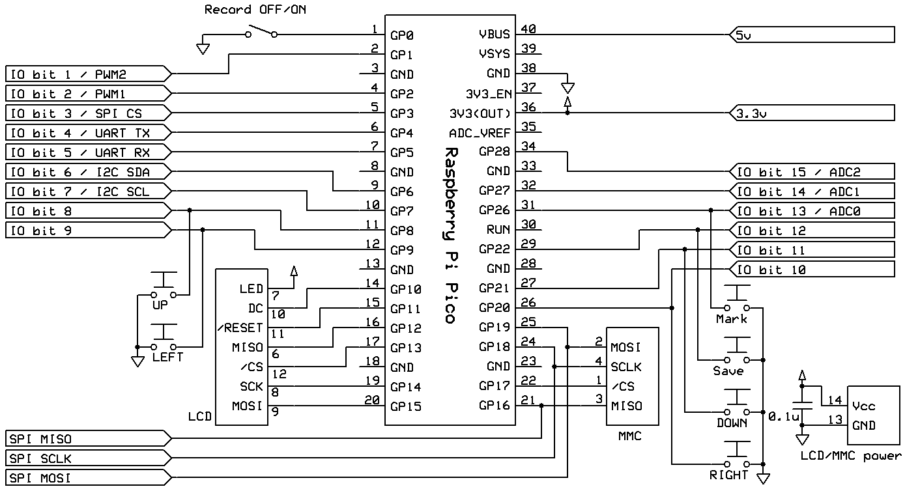
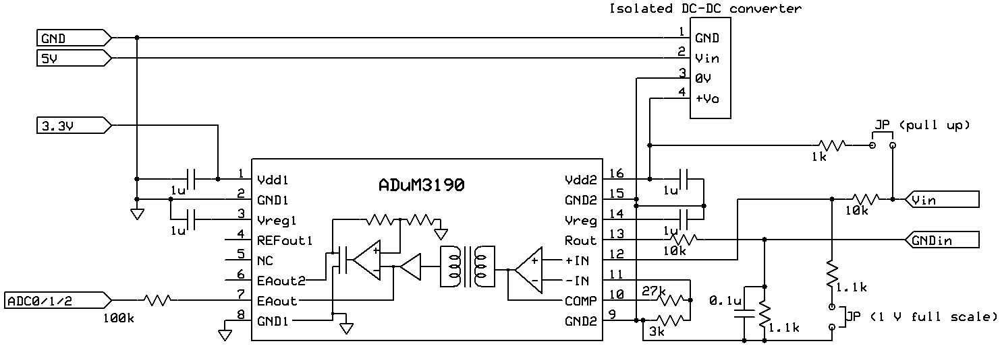

# chart-recorder
Chart recorder using MachiKania type P

## Summary
This chart recorder uses MachiKania type P as operation system to control LCD, MMC/SD card, and ADC. The three ADCs are connected to operational amplifiers (OP-amps) that are isolated from main power line, so each OP-amp/ADC can input different voltage level signals independently. The signals are collected every second, and saved to CSV file in MMC/SD card every 10 seconds.

## Scematic
The Machikania part schematic is as follows

The OP-amp part schematic is as follows


## Version of MachiKania type P
This product requires MachiKania type P ver 1.1.7.1 or later

## Components in MMC/SD card
Place following files in SD card:
```console
MACHIKAP.BAS
MACHIKAP.INI
```
After running the chart recorder software, CHARTxxx.CSV, where "xxx" is 3 digit integer, will be save in the card.

## License
The license of BASIC code is public domain.
